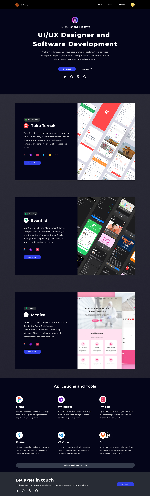

# Tamplate Wordpress my Portofolio ([Preview](https://biscuit.my.id/))

This is my template WordPress portfolio, with an elegant and modern view, I create this template using CMS WordPress. with a light or dark mode feature.



### Folder Structure
Please paste this file into folder:

```
yourWordress/wp-content/themes/
```

Here is the core folder structure which template wordpress.

```
|- aseets
|- includes
|- template
|- 404.php
|- footer.php
|- fuctions.php
|- header.php
|- index.php
|- page.php
|- style.css
```

### Required Plugins 

* [Genesis Custom Blocks](https://developer.wpengine.com/genesis-custom-blocks/)
